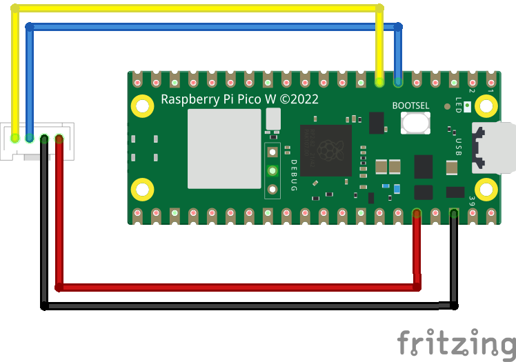

# Using a Tiny Code Reader on a Raspberry Pi Pico

Example code that shows how to interface the Raspberry Pi Pico to [Useful 
Sensor's](https://usefulsensors.com) 
[Tiny Code Reader](https://usfl.ink/tcr) board over I2C.

## Introduction

The Tiny Code Reader is a small, low-cost hardware module that reads QR codes.
It's designed to be a simple way to provision a system, for example by providing the wifi network name and password, or to provide input when there's
no keyboard. 

There's a [detailed developer guide](https://usfl.ink/tcr_dev)
available, but this project has sample code that shows you specifically how to 
get the module up and running with a Raspberry Pi Pico using C.

## Building

Make sure that you're able to build and run the standard Raspberry Pi Pico
examples, like `blink`. You can find general instructions on this in the 
[Pico Getting Started Guide](https://datasheets.raspberrypi.com/pico/getting-started-with-pico.pdf),
and [here's a Colab notebook that might help](https://usfl.ink/pico_blink_colab).
The main issues to watch out for are ensuring that `PICO_SDK_PATH` is set as an
environment variable, and points to the right location.

Once you're ready, run the following commands from within this repository's
folder to create the build files:

```bash
mkdir build
cd build
cmake ..
```

After that succeeds, you should be able to run the compilation stage:

```bash
make
```

There should now be a binary at `build/code_reading_example.utf2`. You can
install this on your Pico board, though it won't work until you wire up the
sensor to the right pins.

## Wiring Information

Wiring up the device requires 4 jumpers, to connect VDD, GND, SDA and SCL. The 
example here uses I2C port 0, which is assigned to GPIO4 (SDA, pin 6) and GPIO5
(SCL, pin 7) in software. Power is supplied from 3V3(OUT) (pin 36), with ground
attached to GND (pin 38).

Follow the wiring scheme shown below:



If you're using [Qwiic connectors](https://www.sparkfun.com/qwiic), the colors 
will be black for GND, red for 3.3V, blue for SDA, and yellow for SDC.

## Running Code Detection

Once you have the module wired up, connect the Pico over USB while holding the
`bootsel` button to mount it as a storage device, copy the 
`face_detection_example.utf2` file over to it, and it should begin running. To 
see the logging output you'll need to set up `minicom` or a similar tool. Once
that is done, you should start to see information about the faces it spots, or
error messages. If you hold the sensor so that it's pointing at a QR code
you should see output like this:

```
Found 'http://en.m.wikipedia.org'
```
To get this output, I opened [an example QR code](https://en.wikipedia.org/wiki/QR_code#/media/File:QR_code_for_mobile_English_Wikipedia.svg)
on my phone and held it about fifteen centimeters or six inches from the 
module, facing the camera.

## Troubleshooting

### Power

The first thing to check is that the sensor is receiving power through the
`VDD` and `GND` wires. The simplest way to test this is to look at the LED on
the front of the module. Whenever it has power, it should be flashing blue
multiple times a second. If this isn't happening then there's likely to be a
wiring issue with the power connections.

### Communication

If you see connection errors when running the code detection example, you may
have an issue with your wiring. To help track down what's going wrong, you can
copy over the `scan_i2c.utf2` file to the board, and this will display which
I2C devices are available in the logs. Here's an example from a board that's set
up correctly:

```
00 .  .  .  .  .  .  .  .  .  .  .  .  @  .  .  .
10 .  .  .  .  .  .  .  .  .  .  .  .  .  .  .  .
20 .  .  .  .  .  .  .  .  .  .  .  .  .  .  .  .
30 .  .  .  .  .  .  .  .  .  .  .  .  .  .  .  .
40 .  .  .  .  .  .  .  .  .  .  .  .  .  .  .  .
50 .  .  .  .  .  .  .  .  .  .  .  .  .  .  .  .
60 .  .  .  .  .  .  .  .  .  .  .  .  .  .  .  .
70 .  .  .  .  .  .  .  .  .  .  .  .  .  .  .  .
Done.
```

The important entry is the first `@` shown on line starting with `00`. This
indicates that there's a response on the address `0x0C`, which is the fixed
location of the person sensor. If the `@` isn't present at this point in the
grid then it means the sensor isn't responding to I2C messages as it should be.
The most likely cause is that there's a wiring problem, so if you hit this you
should double-check that the SDA and SCL wires are going to the right pins.

## Running Wifi Provisioning

I often need to connect microcontrollers to Wifi, but that usually requires
reprogramming them or at least editing a text file. QR codes make it possible
to easily set the Wifi name and password at runtime.

On Android [you can just go to Wifi settings, choose share](https://www.theverge.com/23561652/android-ios-wifi-password-share-how-to),
and it will display a code containing the name and password of the network
you're currently connected to. [It's also possible to do the same thing on iOS](https://osxdaily.com/2021/07/08/how-share-wi-fi-password-qr-code-shortcuts/)
but it's a bit more fiddly.

This example application shows how to read a Wifi settings QR code and use it
to automatically connect. To use it, copy the `wifi_provisioning.uf2` file from
`build/` onto your Pico W. It will start the Tiny Code Reader, and then once 
you display a QR code generated using one of the methods above it should use 
the SSID name and password to connect to the network. You can verify that it
worked by connecting to a serial port and looking for output like:

```bash
Trying to connect to <SSID>:<Password>
Connected to 'WIFI:S:<SSID>;T:WPA;P:<Password>;H:false;;'.
```

It's also possible to store the connection details in Flash once they've been
read once so that they persist over reboots, but that's [complex enough](https://kevinboone.me/picoflash.html?i=1)
to be outside of the scope of this example.

## Writing your own Applications

Hopefully the example code shown here should give you a good starting point for
using the sensor in your own projects, but you can see more details about the
interface in [`tiny_code_reader.h`](https://github.com/usefulsensors/tiny_code_reader_pico_c/blob/main/tiny_code_reader.h).
This header contains the data structures used to return information from the
peripheral, and functions to read and configure the device.
If you are trying to port this code to a different board, you can check the
[developer guide](https://usfl.ink/tcr_dev) to see if there's already support
for your platform, and if not, the main differences are likely to be in the I2C
initialization, reading, and writing implementations. If you can find examples
of how to do the I2C bus setup on the new board, and then equivalents to the
`i2c_read_blocking` and `i2c_write_blocking` functions, you should be able to
reuse the rest of the data structures and logic.
